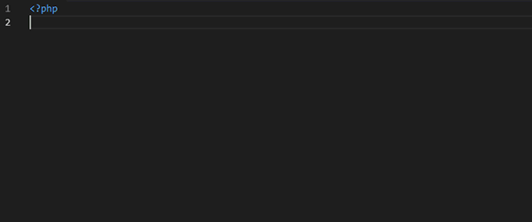

# PHP Form Builder

PHP Form Builder is a Visual Studio Code extension for [**Php Form Builder**](https://www.phpformbuilder.pro "Php Form Builder"),
php class to build Bootstrap 4, Bootstrap 5, Bulma, Foundation, Material, Tailwind, uiKit and custom forms sold on [Codecanyon](http://codecanyon.net/category/php-scripts "Codecanyon").

PHP Form Builder adds auto-completions for Form Builder's PHP class methods.

## Features

* Displays completions with details of functions and arguments
* Shows links to online documentation
* Shows links to online code examples

## Usage

start typing the name of a PHP Form Builder function, the auto-complete list will appear.

OR

start typing "*form*" to show all the available completions

--

enter "*newForm*" to create a full basic form with validation and email sending.

## More

PHP Form Builder is also available in the PHP CRUD Generator package
PHP CRUD Generator is a web app that generates a [**PHP MySQL Bootstrap admin panel**](https://www.phpcrudgenerator.com "PHP CRUD Generator") using a visual user interface
